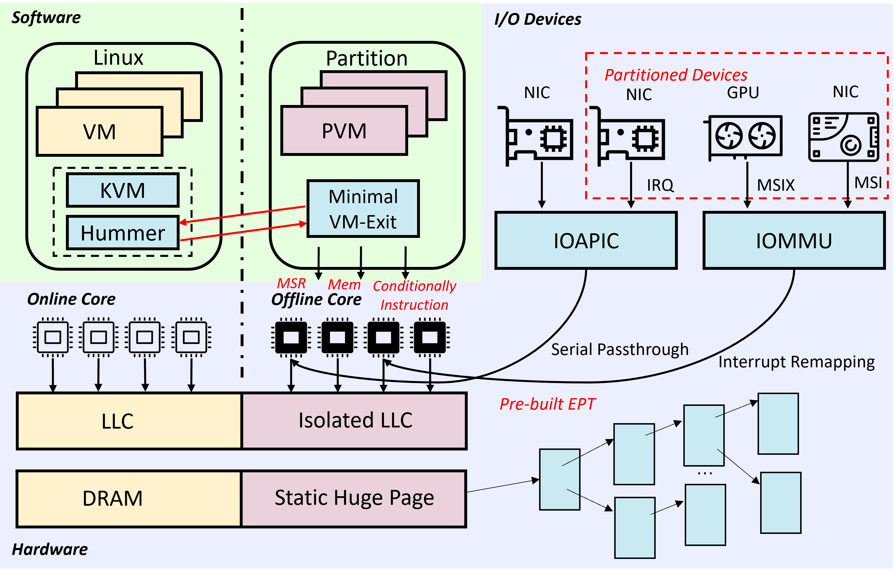
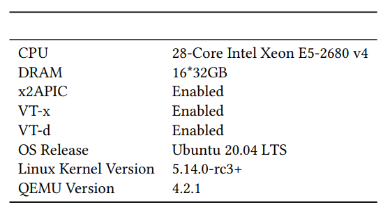

# Capsule

A High-performance Low-latency Hypervisor Based on Resource Partitioning.

The architecture of the project is shown below:

## Hardware Requirements

The following table displays the specific configuration of this host platform. 4 physical CPUs and 2GB physical memory were allocated to the PVM, while 4 vCPUs and 2GB physical memory were allocated to the VM.

## Structure

* capsule.ko, the 5.14.0-r3 capsule kernel module
* linuz.bin, the binary Linux
* boot_param.bin, the boot params
* linux-loader.bin, the bootloader
* rt-tests.cpio, the minimal file system
* linux-demo, a demo to start a VM using capsule

## Usage

1. Add the following args inyo the `GRUB_CMDLINE_LINUX` entry in `/etc/default/grub`："intel_iommu=on memmap=82M$0x3a000000 console=ttyS0". Then `update-grub` and reboot.
2. Install capsule kernel module: `insmod capsule.ko`
3. Run `linux-demo`, then we can see the logs and login entry of VM by serial connection.
